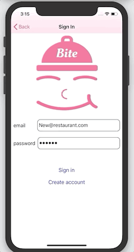
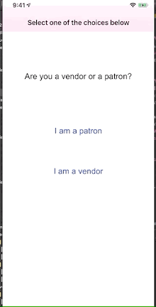

# About 

Every day hundreds of thousands of tons of food are wasted in the United States. Yet at the same time, millions of people in the United States struggle with hunger. Bite is an application that attempts to solve both of these issues by connecting restaurant owners with excess food to people most in need.

The app has two components: vendor and patron. 

### Vendor

As a vendor, the first thing you’ll do is create a new account by inputting an email and password. Afterward, you’ll be prompted to input some general information about your restaurant, which includes pick up instructions that will be presented to the patron when they claim a meal. Once your account is set up, you’ll create ‘offers’ for user consumption. An ‘offer’ is composed of a quantity, an image, a name, allergies, and a window denoted by a start and end time. When the start time of an offer’s window is reached, the offer will become active. Active offers will appear on the patron’s side of the application, where they can claim them. When the end time of the window is reached, the offer will no longer be presented to patrons. 

### Patron

As a patron, you’ll log in via a phone number. Once you’ve logged in, you’ll be presented with a list of restaurants in the Bite network. You can tap on a restaurant to find out more information about it. If the restaurant has offers that are active, they will appear on this page. If not, you’ll be presented with a message letting you know that the restaurant has no active offers. If you tap on an active offer, you’ll be presented with an opportunity to claim an offer. If you decide to claim an offer, a QR Code will be generated. Once you’ve claimed an offer, you’ll be given the opportunity to forfeit the offer if you feel that you cannot claim it, or you simply change your mind. However, if you should choose to forfeit an offer, you will not be able to claim a new offer for the duration of the day. In addition, the same page shows the location of the restaurant on a map, and allows you to get directions if necessary. 

### How the transaction works

When a patron arrives at a restaurant to claim an offer, they will present the QR code to an employee who will scan it. After scanning the code, the employee will either see success or failure. If the scan was successful, the employee will hand the patron the food. Once the transaction is done, the patron will not be able to claim any more offers for the remainder of the day. The opportunity to claim a new meal resets everyday at 6:00 A.M. EDT. 

# Technologies used
Firebase, AVKit, CoreLocation, MapKit

# Using this Application
- This application requires iOS 13.0 or higher. 
- This application makes use of cocoa pods. 

# Preview
### Vendor
Vendor Sign Up | Vendor Main | Create Offer | Scan QR Code | 
------------ | ----------- | ------------ | ------------ |
 |  |  |  | 

### Patron
Patron Sign Up | Patron Experience |
------------ | ----------- |
 | 
